<h1 align="left">Electric Axles</h1>

This project was focused on creating a Full Stack developed fictional e-commerce store using the Django Framework, Python, HTML, CSS and Javascript.
The project also uses stripe for online test payments and Heroky Postgres as a relational database.

Electric Axles is a e-commerce store that primarly sells a variety of personal electric vehilces. This project is for educational purposes only, images used are of exsisting items being sold in the current market.

The live link can be found here: https://portfolio-5-electric-axles.herokuapp.com/

***

#   Table of Contents:
* [User Experience](#user-experience)
    * [User Stories](#user-stories)
    * [Wireframes](#wireframes)
    * [Design](#design)
        * [1. Typography](#typography)
        * [2. Color Scheme](#color-scheme)
        * [3. Imagery](#imagery)
* [Database Schema](#database-schema)
* [Technologies Used](#technologies-used)
* [Features](#features)
    * [Existing Features](#existing-features)
    * [Features left to implement](#features-left-to-implement)
* [Testing](#testing)
    * [User Stories Testing](#user-stories-testing)
    * [Code Validation](#code-validation)
    * [Maual Testing](#manual-testing)
    * [Automated Testing](#automated-testing)
* [Bugs](#bugs)
* [Deployment](#deployment)
* [Credits](#credits)
* [Acknowlegments](#credits)

***

#  User Experience:

Github projects was used to organise the projects user stories. Each user story was categorised and labeld according to relevance/importance and was placed in a milestone. 
All these user stories was placed on a basic kanban board and oraganised by: to do, in progress and done.
User stores were placed accordingly when been worked on and on completion where moved to done and had their issue closed. This was reflected in the milestones giving a better visual representation on progress.
Link to [Milestones](https://github.com/dhowai/portfolio-5-electric-axles/milestones) and [Projects](https://github.com/dhowai/portfolio-5-electric-axles/projects/1).

-   ## User Stories:

    -   ### First Time visitor/User Goals
        -   As a first time User, I want to be able to easily navigate the site.
        -   As a first time User, I want to have the ability to register on the site.
        -   As a first time User, I want to view the complete store content.
        -   As a first time User, I want to be able to purchase items.

    -   ### Returning registered User Goals 
        -   As a registered User, I want to have the ability to login to the site with my credentials.
        -   As a registered User, I want to be able to purchase items.
        -   As a registered User, I want to be able to save items for later purchase.
        -   As a registered User, I want to be able to edit/save any information I entered Prior.
        -   As a registered User, I want to have the ability to logout of the site. 

    -   ### Frequent User Goals 
        -   As a frequent User, I want to easily find any new updates to the site.
        -   As a frequent User, I want to easily purchase an item with previous information saved.
    
    -   ### Administrator User Goals
        -   As an Administrator, I want to be able to access the Administration panel.
        -   As an Administrator, I want to have the ability to manage site products.
        -   As an Administrator, i want to be able to give other users administrator abilities to help maintain the site.

[Back to Top](#table-of-contents)

-   ## Wireframes

    Balsamiq was used to create initial site layout wireframes to get a rough idea of what the site should look like.

    -   ### [Home Page](docs/wireframe/home.png) - A welcome page for the site with brief details.
    -   ### [Register Page](docs/wireframe/register.png) - A page for user to register an account.
    -   ### [Sign Page](docs/wireframe/sign-in.png) - A page for users to sign-in, similar for log-out
    -   ### [Products](docs/wireframe/products.png) - A page for all products being sold
    -   ### [Product Details](docs/wireframe/product-details.png) - A page for a single product with more details.
    -   ### [Product Management](docs/wireframe/product-management.png) - A page to edit/add products to site.
    -   ### [Basket](docs/wireframe/basket.png) - A page to view all products in users basket.
    -   ### [Checkout](docs/wireframe/checkout.png) - A page for the user to checkout items in basket.
    -   ### [Profile](docs/wireframe/profile.png) - A page for the user to update any information enter prior.
    -   ### [Mobile Home](docs/wireframe/mobile-home.png) - Mobile view for home page
    -   ### [Mobile Products](docs/wireframe/mobile-products.png) - Mobile view for all products page
    -   ### [Mobile Products Details](docs/wireframe/mobile-products-detail.png) - Mobile view for a single products page
    -   ### [Mobile Basket](docs/wireframe/mobile-basket.png) - Mobile view for users basket, similar for checkout page.

   
[Back to Top](#table-of-contents)

-   ## Design

    -   ### Typography
        -   The Roboto font was used for the headings, the Lato font is used for the body elements and both have sans-serif as a backup. These fonts were chosen because they compliment each other well.

    -   ### Color Scheme
        -  Update the color scheme to pallet

        
        
    -   ### Imagery 
        -   The images used for the products were taken from a real bussiness called [Ride And Glide](https://www.rideandglide.co.uk/), images were only used for educational purposes and all rights of these images belong to the site.

[Back to Top](#table-of-contents)

# Database Schema

SQLite was used during the development of the site and then moved to Postgres in Heroku.

 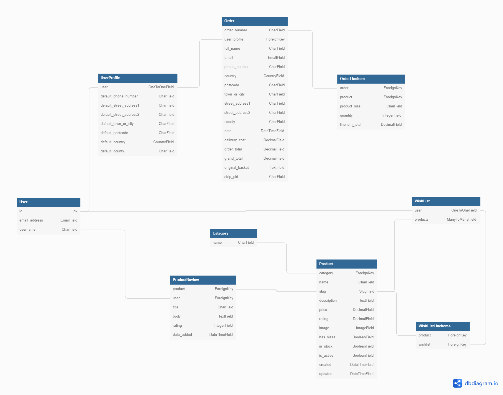

-   ##  Applications

    -   ### Product
        - This app controls the products in the store. There are three models used to store various data: `Category`, `Product` and `ProductReview`.
        
        - `Products` enables items to be added to the database in order for them to be viewed and purchased. Only users that have superuser status can add items to the store through the `add_product` view. This model is connected to the `Category` model through a foreign key.
        - `Category` stores category names and is connected to the `products` model, which allows the products to be filtered easily on the site.
        - `ProductReview` allows the user to create a review for a product. It is connect by the products slug. It is also connect to the user's username whcih gets displayed on successfull review posted.
    
    -   ### Checkout  
        - This app handles the purchasing of items on the store. It contains two models: `Order` and `OrderLineItem`.

        - `Order` contains the user's shippping details needed for the order to be completed. It is a foreign key to the `UserProfile` which stores the user's information, if saved. It also contains the items in the basket, the total costs and stripe_pid    which is used to handle the online card payments. Also generates an unique order_number through UUID.
        - `OrderLineItem` stores all details for the specific order. It has a foreign key to `Product` and `Order` to capture all this information.

    -   ### Profiles
        - This app contains a model `UserProfile` which stores user's default billing information. It is also connected to the User model through a OneToOneField.

    -   ### Wishlist
        - This app contains two models called `WishList` and `WishListLineItems`. This allows the user to save items to a list for later purchase.

        - `WishList` is connected to the User model through a OneToOneField which distinguishes which user is saving items to their list. It is also connect to the product model through a ManyToMany field which also the user to choose these products for thier list.
        - `WishlistLineItem` is connected to the `Wishlist`l and the `Products` model through a foreign key. Due to using a through in the  `WishList` model, the items from that model and passed through this model to be displayed.

[Back to Top](#table-of-contents)

# Technologies Used

-   ## Programming Languages, Framworks and Editors
    -   [HTML5](https://en.wikipedia.org/wiki/HTML5)
    -   [CSS3](https://en.wikipedia.org/wiki/CSS)
    -   [JavaScript](https://en.wikipedia.org/wiki/JavaScript) 
    -   [Python](https://www.python.org/)
    -   [JQuery](https://jquery.com/)
    -   [Django](https://www.djangoproject.com/)
    -   [Git](https://git-scm.com/)
    -   [Github](https://github.com/)

-   ### Tools Used:
    -   [Heroku](https://www.heroku.com/)
    -   [AWS S3 and IAM](https://aws.amazon.com/)
    -   [Bootstrap](https://getbootstrap.com/)
    -   [PostgreSQL](https://www.postgresql.org/)
    -   [Balsamiq](https://balsamiq.com/)
    -   [Google Fonts](https://fonts.google.com/)
    -   [Font Awesome Icons](https://fontawesome.com/)

[Back to Top](#table-of-contents)

# Features 

## Existing Features

- Index/Home page
    - When a user first enters the site, they are greeted with a welcome title and a site banner.
    - The site banner has information about the sites review score, free delivery and how to get in touch(maybe).
    - As the user scrolls down, they can read short bits of information about the site.

    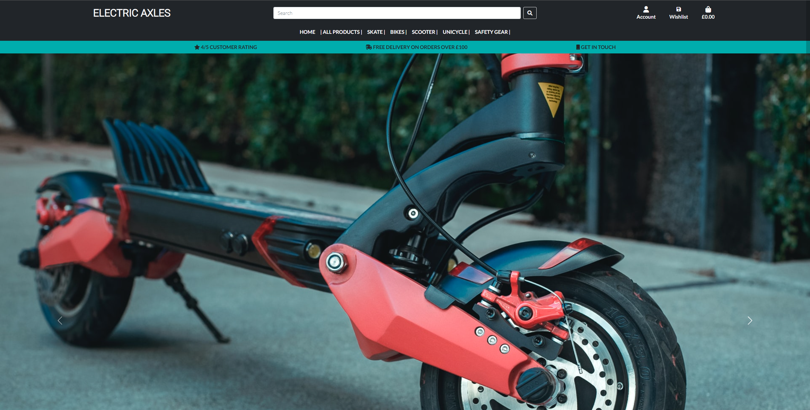    

- Navigation Bar
    - The top navigation bar has a the site name, search bar, my account, wishlist and a basket icon as its elements.
    - The site name takes you home.
    - Search bar lets you search all items on the site, using keywords in their product name or description.
    - My account lets you login or register you're account.
    - Clicking on the wishlist only takes you to the wishlist page if you are logged in. Otherwise it takes you to the sign in page.
    - The basket icon takes you to your current shopping basket.
    - The lower part of the navigation bar has the main site product groups, clicking on them brings up a dropdown menu with more product category options.

    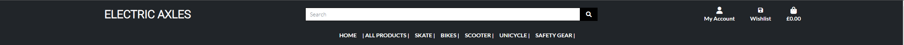

    - Logged in users have additional options in my account, such as to logout or to view your profile. Superuser also have the additional option to product management.

    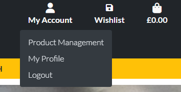

    - The product navigation bar has various dropdown menu options, the all products tab has options that are filtered accordinly by name e.g. by price(high - low) etc.
    - The other options represent each product group and their sub groups which match their product decription. e.g the skate has all products that are electric skateboards and their various brands.
    - Each navbar option can also take you to all the products that satisfys that groups product type and can be filtered even more.
    
    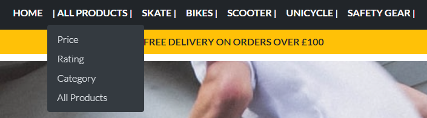

    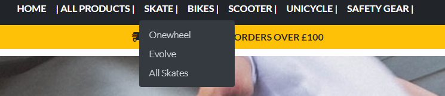    

- Home page information
    - The home page has very breif snipits of information about the site.(redo?)

     

- Footer 
    - Here the user can find out more about the developer with links to their social accounts. It also has a short description about the site(add contact us option?)

    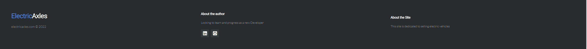 

- The register/login page
    - The registration/login pages use the django-allauth package. The forms used are extended from the respected allauth templates and styled with crispy forms.
    - These forms have validations that tell the user if any data they enetered is invalid.

     

- The Product/Store Page
    - The store pages have various filter options in place. They are categorized by price, rating, category and name.

    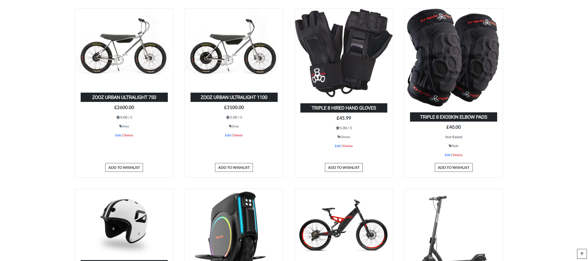 

    - On these various pages, the user has options to change that filter according. Each sub product group also has links of the different categories in that sub group on the top of the page.

    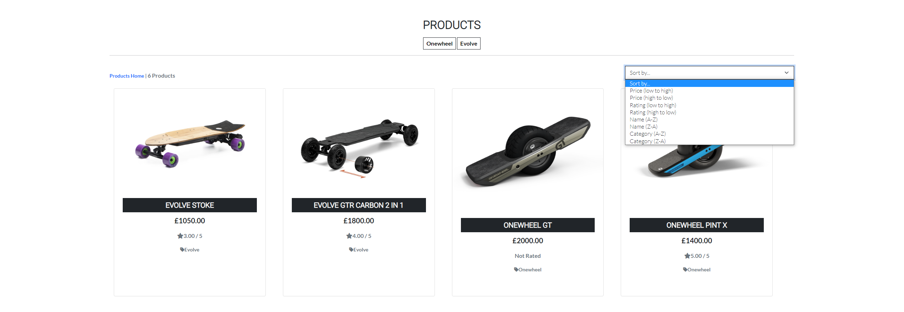

    - When using the search bar, the user can see the result of their search directly on the page and an option to return to the all products page.

    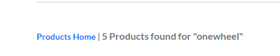 

- The product Detials Page

    - When a product is clicked on, the user is taken to that product full details page. There the user has the option to choose the quantity and add the item to their basket, logged in users have the additional option to add the item to their wishlist.
    - Superusers have the additional option to edit/delete products.

    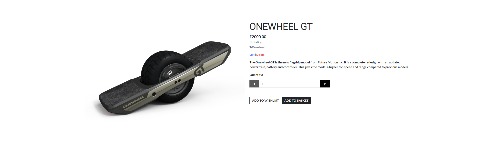

    - Logged in users also have the option to leave a review, whereas guests are given the message to sign in or register an account to be able to do so.
    - To leave a review a title, body and a rating is needed and on success is dislayed on the same page.

    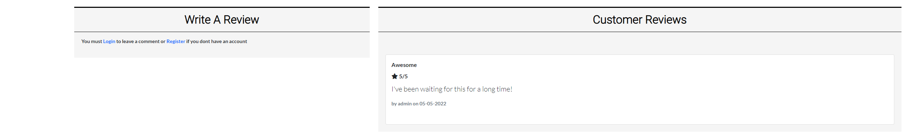

- Product Management 

    - Superusers have the option to add/edit products on the store.
    - There are options to take the superuser to these edit pages from the all products page or the product details page.
    - On success they are redirected to the product details page for that item.

    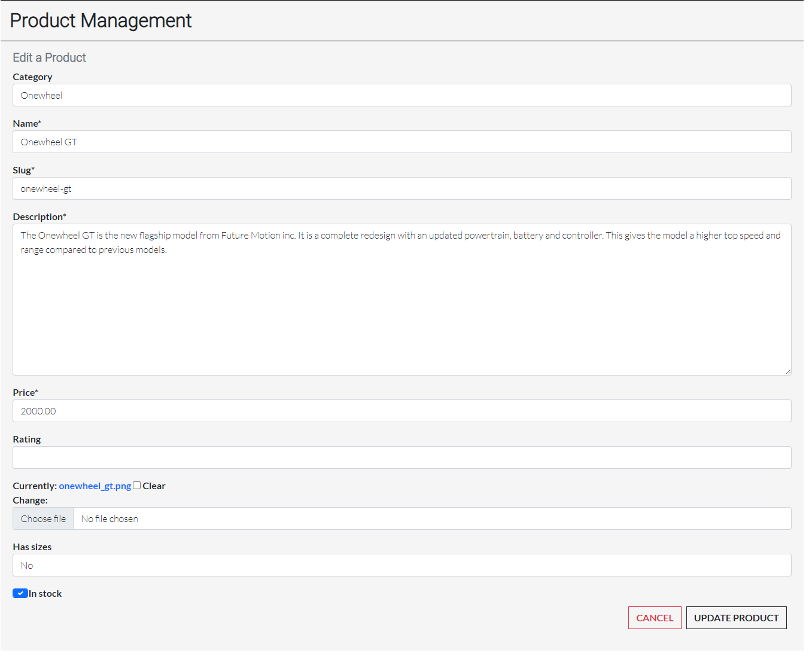

- Profile

    - Users can navigate to this page through the my account in the navigation bar.
    - Here the user can update their shipping/billing information.
    - There is also summary of the users transactions.

    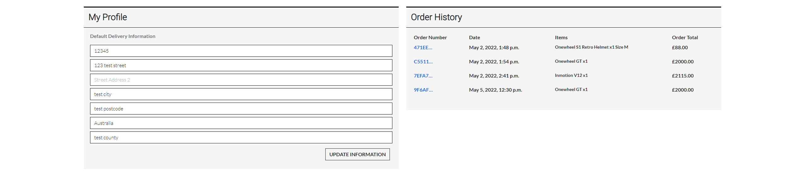

- Wishlist

    - This page is displays all the items the user has added on their wishlist.
    - Only logged in users can add items to their wishlist.
    - They can do so from the products or from the products details page.
    - This page can be navigated to from the main nav at the top.
    - On this page a user can remove these items from their wishlist or click on them and add them to their basket. 

    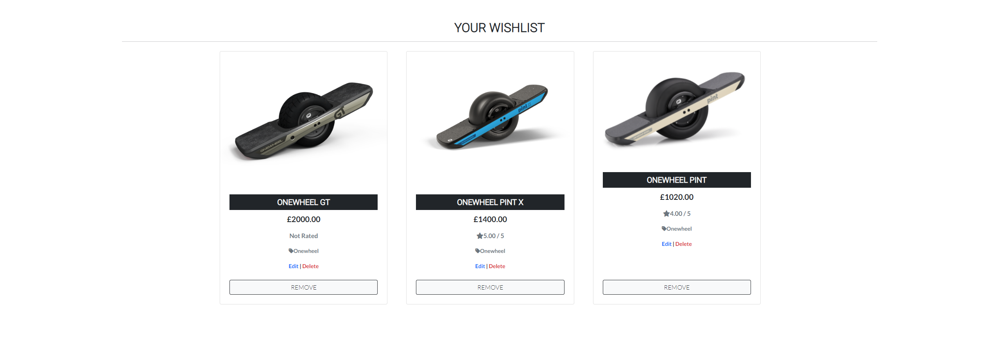

- The Basket

    - After adding an item to the basket the user can navigate using the basket icon or the toast to the basket view.
    - Here the user can see a summary of all the items currently in their basket.
    - They can update the quantity of the product and delete the product from their basket.
    - There is also a summary of the costs and buttons to either go back to the store or proceed to checkout.

    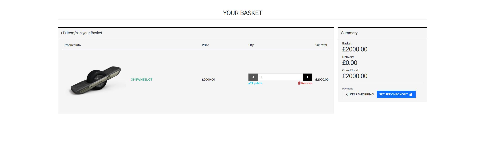

- Checkout

    - Here the user can fill in their billing/shipping details to proceed with the transaction.
    - A basket summary is also present.
    - A logged in user also has the option to save their entered details to the users profile.
    - Stripe was used for the payment method for this site.
    - On checking out an overlay covers the screen as the information gets checked by stripe.

    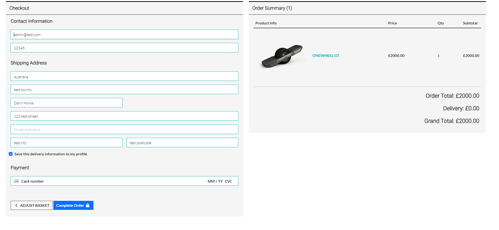

    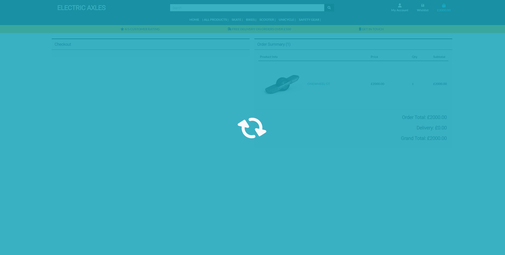

- Checkout Success

    - On success the user is taken to a success page showing a summary of the information entered.
    - An email is also sent to the user using django and gmail. Giving them a copy of the transaction details.

    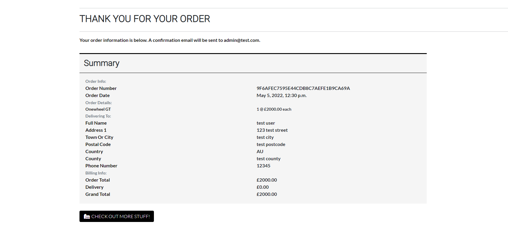

- Toasts 

    - The site uses toasts from bootsrap to display all the relevent messages/actions from the site.
    - There is a toasts for success, info, errors and for warnings.
    - These toasts inform the user of different actions, such as displaying when items get succesffuly added to the basket.

    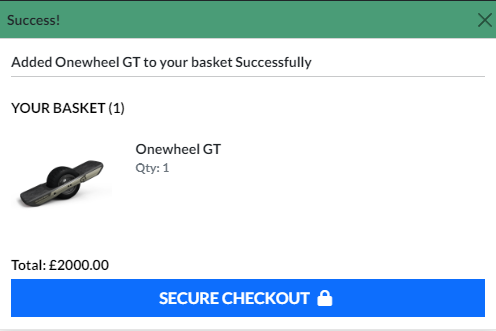

[Back to Top](#table-of-contents)

## Features left to Implement

-   Possible features to add in future updates:
    -   Add pagination for comments and produts page for better user experience.
    -   Ability for users to delete their account.
    -   Have a group in the navigation bar for new items, items on sale etc.
    -   Create own unique 404 and 500 error pages to redirect user to.
    -   Use a modal as a confirmation before delelting a product from the site.
    -   Have a custom page/message informing guest users to create an account to use wishlist feature.
    - (Add more)

[Back to Top](#table-of-contents)

# Testing

## User Stories Testing

-   First Time Visitor/User Goals

    -   As a first User, I want to be able to easily navigate the site.
    
        -   When the visitor first enters the site they are greeted with a welcome message.
        -   The homepage has brief information snippits about the site.
        -   The user can browse by price, category, rating or by different product groups.

    -   As a first time User, I want to have the ability to register on the site.

        -   There is the my account on the navbar which gives options for the user to login or register.
        -   When a user views a products detail page they can view the product reviews, but would need an account to post one. The relevent links can be found on that page to do so.
    
    -   As a first time User, I want to view the complete store content.

        -   The user can view all content on the site with the relevant filter options.

    -   As a first time User, I want to be able to purchase items.

        -   The new user can purchase items on the site without the need for an account.
        -   They would need to create an account to save their shipping/billing details.

-   Returning Registered User Goals

    -   As a registered User, I want to have the ability to login to the site with my credentials.

        -   The user can do so from the navigation bar.
        -   Or from any product details page, which requires them to login to post a review.

    -   As a registered User, I want to be able to purchase items.

        -   They can do so with additional benefits.
    
    -   As a registered User, I want to be able to save items for later purchase.

        -   Users have an option to do so from the all products view or the product details page.
        -   They can view them in the wishlist icon in the navbar.

    -   As a registered User, I want to be able to edit/save any information I entered Prior.

        -   The user can do so and have the additional option to save their information to their profile.
        -   This creates a faster checkout process in the future.

    -   As a registered User, I want to have the ability to logout of the site. 

        -   From the navigation bar, the my account dropdown gives the user the option to logout.

-   Frequent User Goals

    -   As a frequent User, I want to easily find any new updates to the site.

        -   When viewing the all products page the newest items are always displayed first.

    -   As a frequent User, I want to easily purchase an item with previous information saved.

        -   Registered users who have saved their information on checkout can use the same information on their newxt purchase.
        -   This creates a faster checkout option for users.

-   Administrator User Goals

    -   As an Administrator, I want to be able to access the Administration panel.

        -   The can access this django admin page by typing /admin at the end on the site name and login with their credentials.
        -   Here they can edit all aspects of the site, from users, products and orders.

    -   As an Administrator, I want to have the ability to manage site products.

        -   They can do so from the django admin or from the site itselft.
        -   There are options to edit/delete products from the all products page and the products details page.
    
    -   As an Administrator, i want to be able to give other users administrator abilities to help maintain the site

        -   Admins can gives other users superuser permissions from the django admin sections.
        -   This gives more users the ability to maintain the site.

[Back to Top](#table-of-contents)

## Code Validation 

-   HTML

    -   Used [W3C Validation](https://validator.w3.org/) to validate the HTML code.

    

-   CSS

    -   Used [(jigsaw) validatior](https://jigsaw.w3.org/css-validator) to validate the CSS code.

        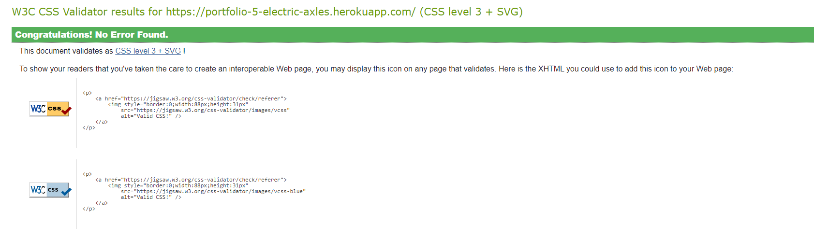

-   JavaScript

    -   [JSHint](https://jshint.com/) was used to check for any major errors in the scripts.

-   Python Code

    -   No errors were returned when testing python code with [PEP8](http://pep8online.com/) except for some instances where imports were asking for docstrings in github.

## Manual Testing

Google Chrome developer tools were used throughout the development process to test breaking points in the site.

-   Toasts
    - The site uses bootstrap toasts to display relevant validation inputs on the site.
    - Success toast apears when items are added to th basket, removed from basket, logging in and much more.
    - Info toast displays when editing products, viewing past orders etc.
    - Error toast displays if any input was incorrect such as entering nothing in the search bar.

    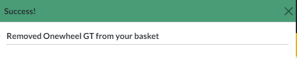 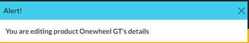 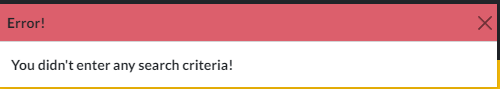 

-   Navigation Bar
    - Navigation bar is responsive to different screen sizes. It is fully displayed on large to medium screens then condenses into icons for smaller screens.
    - All links correctly redirect the user to the corresponing pages.
    - User logged in can see the option to view their profile and logout.
    - Superusers can see the additional option to manage products.

-   Footer
    - Links redirect to the correct social media on a new page.

-   Products
    - The default all products page displays products by the date the were added.
    - The are displayed in cards and show the items name, price, rating and a link to their category.
    - Logged in users have the additional option to add the item to their wishlist.
    - Superusers have the aditional option to edit/delete the products.

-   Product details
    - These pages have the same information as the general all products page with the addition of adding the item to the shopping basket.
    - Product details match the information in the database and get displayed correctly.
    - Quantity buttons works, cant go less than 0 or highier that 20.
    - Add to wishlist is only displayed for logged in users.
    - If an item is not in stock a message gets displayed successfully and only logged users can add these items to their wishlist.
    - The add to basket button gets removed if these conditions are met. 

    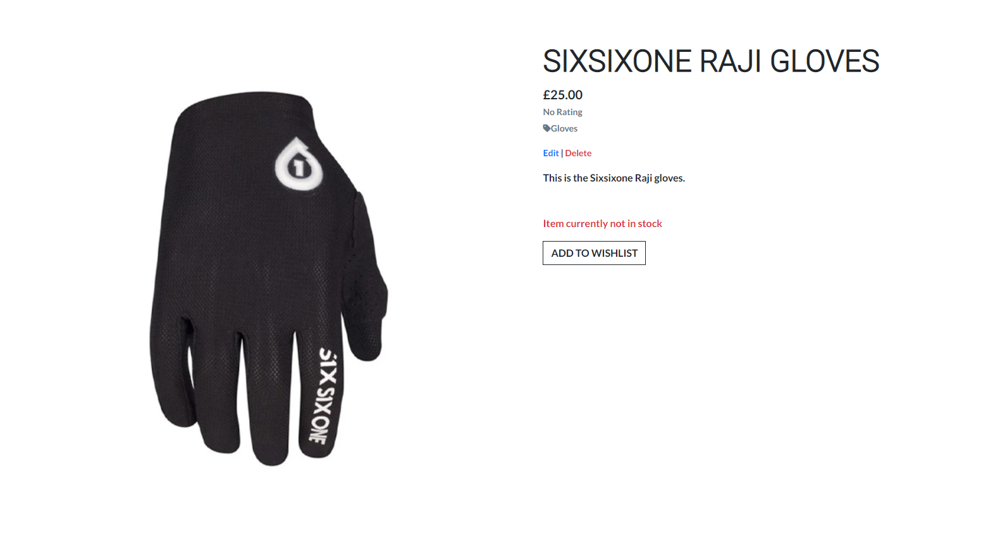

-   Reviews
    - Displays all reviews made for that product and displays a message if they are no reviews made.
    - Users can only post a review if logged in.
    - The logged in user has the option to edit their review or even delete it if they choose. But, only if they were the user who created it.
    - Superusers have the additional permission to edit or delete and review made.
    - The toasts successfully display the messages to the page depening on what actions is being done.

-   Wishlist
    - Confirmed only logged in users can this feature.
    - If empty a message gets displayed with a link to the store.
    - Guest users are redirected to the sign in page if they click on the wishlist.
    - Removing item from their wishlist works correctly.
    - Toast uses info class to tell user which item was entered to wish list and when it was removed.

-   Basket
    - Icon in the navigation bar takes the user to the basket. The basket gets updated when items are added, updated and deleted.
    - Basket icon changes color when items are added to the basket.
    - Quantity buttons here reflect the quantity added from the product details page.
    - Basket gets updated when adjustments are made here.
    - Items in basket remain when user log in beforehand. Sign the session data is keep stored corectly.
    - Correct totals and sub totals are correct.
    - Free delivery is being calculated correctly. 

-   Checkout
    - Item data is the same from the basket page.
    - Form validation works and informs what error is being made.
    - Stripe correctly displays if the order is successful.
    - Users billing/shipping details get populated if it was saved previously. 
    - Stripe webhook shows if the order was created from the database or had to be created from the webhook data on stripes payment intent succeeded event with 200 response.
    - Stripe test card input `4242 4242 4242 4242` works when completing an order.
    - Overlay covers screen when information is entered.
    - An error in the card information displays correctly.
    - Success toast displays with order number on success payment.
    - Redirects to checkout success page if form validation matches stripes.

    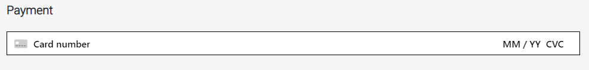

-   Admin
    - Only admins have access to product management page from the my account dropdown.
    - Only admins can see and use the edit/delete products.
    - Product management goes to the correct page to add an item.
    - The correct details appear from the database in from when editing a product.
    - Toasts successfuly appear when superuser is editing a prouct, edited a product and deleted a product.

## Automated Testing  

- 
[Back to Top](#table-of-contents)

# Bugs

-  

# Deployment

This fullstack application was deployed to GitHub pages, using Gitpod as a development environment. The changes were commited using the git version control, using the push command in Gitpod to save changes with messages into GitHub. Any secret environment variables were stored in an `env.py` files which was added by default to the `.gitignore` file using Code Institutes Gitpod template. 

## Deployment to Heroku

[Back to Top](#table-of-contents)

# Credits

- 

## Media

- 

# Acknowledgements

-   The students on Slack for peer review
-   The tutor support provided by Code Institute
-   Stackoverflow for troubleshooting problems

[Back to Top](#table-of-contents)