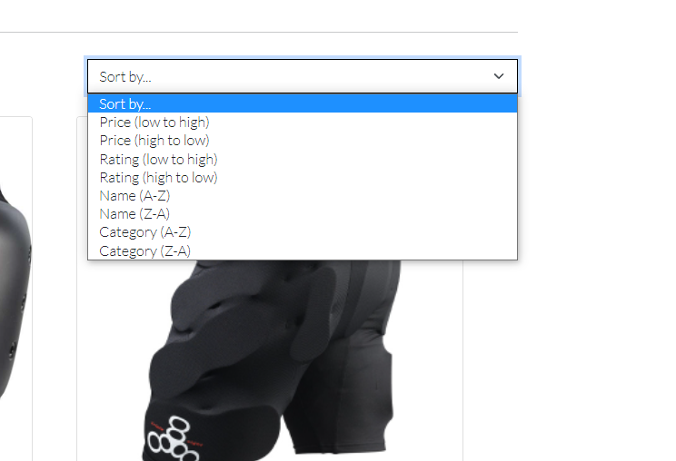

<h1 align="left">Electric Axles</h1>

This project was focused on creating a Full Stack developed fictional e-commerce store using the Django Framework, Python, HTML, CSS and Javascript.
The project also uses stripe for online test payments and Heroky Postgres as a relational database.

Electric Axles is a e-commerce store that primarly sells a variety of personal electric vehilces. This project is for educational purposes only, images used are of exsisting items being sold in the current market.

The live link can be found here: https://portfolio-5-electric-axles.herokuapp.com/

***

#   Table of Contents:
* [User Experience](#user-experience)
    * [User Stories](#user-stories)
    * [Wireframes](#wireframes)
    * [Design](#design)
        * [1. Typography](#typography)
        * [2. Color Scheme](#color-scheme)
        * [3. Imagery](#imagery)
* [Database Schema](#database-schema)
* [Technologies Used](#technologies-used)
* [Features](#features)
    * [Existing Features](#existing-features)
    * [Features left to implement](#features-left-to-implement)
* [Templates](#templates)
* [Testing](#testing)
    * [User Stories Testing](#user-stories-testing)
    * [Code Validation](#code-validation)
    * [Maual Testing](#manual-testing)
    * [Automated Testing](#automated-testing)
* [Bugs](#bugs)
* [Deployment](#deployment)
* [Credits](#credits)
* [Acknowlegments](#credits)

***

#  User Experience:

Github projects was used to organise the projects user stories. Each user story was categorised and labeld according to relevance/importance and was placed in a milestone. 
All these user stories was placed on a basic kanban board and oraganised by: to do, in progress and done.
User stores were placed accordingly when been worked on and on completion where moved to done and had their issue closed. This was reflected in the milestones giving a better visual representation on progress.
Link to [Milestones](https://github.com/dhowai/portfolio-5-electric-axles/milestones) and [Projects](https://github.com/dhowai/portfolio-5-electric-axles/projects/1).

-   ## User Stories:

    -   ### First Time visitor/User Goals
        -   As a first time User, I want to be able to easily navigate the site.
        -   As a first time User, I want to have the ability to register on the site.
        -   As a first time User, I want to view the complete store content.
        -   As a first time User, I want to be able to purchase items.

    -   ### Returning registered User Goals 
        -   As a registered User, I want to have the ability to login to the site with my credentials.
        -   As a registered User, I want to be able to purchase items.
        -   As a registered User, I want to be able to save items for later purchase.
        -   As a registered User, I want to be able to edit/save any information I entered Prior.
        -   As a registered User, I want to have the ability to logout of the site. 

    -   ### Frequent User Goals 
        -   As a frequent User, I want to easily find any new updates to the site.
        -   As a frequent User, I want to easily purchase an item with previous information saved.
    
    -   ### Administrator User Goals
        -   As an Administrator, I want to be able to access the Administration panel.
        -   As an Administrator, I want to have the ability to manage site products.
        -   As an Administrator, i want to be able to give other users administrator abilities to help maintain the site.

[Back to Top](#table-of-contents)

-   ## Wireframes

    Balsamiq was used to create initial site layout wireframes to get a rough idea of what the site should look like.

    -   ### [Home Page](docs/wireframe/home.png) - A welcome page for the site with brief details.
    -   ### [Register Page](docs/wireframe/register.png) - A page for user to register an account.
    -   ### [Sign Page](docs/wireframe/sign-in.png) - A page for users to sign-in, similar for log-out
    -   ### [Products](docs/wireframe/products.png) - A page for all products being sold
    -   ### [Product Details](docs/wireframe/product-details.png) - A page for a single product with more details.
    -   ### [Product Management](docs/wireframe/product-management.png) - A page to edit/add products to site.
    -   ### [Basket](docs/wireframe/basket.png) - A page to view all products in users basket.
    -   ### [Checkout](docs/wireframe/checkout.png) - A page for the user to checkout items in basket.
    -   ### [Profile](docs/wireframe/profile.png) - A page for the user to update any information enter prior.
    -   ### [Mobile Home](docs/wireframe/mobile-home.png) - Mobile view for home page
    -   ### [Mobile Products](docs/wireframe/mobile-products.png) - Mobile view for all products page
    -   ### [Mobile Products Details](docs/wireframe/mobile-products-detail.png) - Mobile view for a single products page
    -   ### [Mobile Basket](docs/wireframe/mobile-basket.png) - Mobile view for users basket, similar for checkout page.

   
[Back to Top](#table-of-contents)

-   ## Design

    -   ### Typography
        -   The Roboto font was used for the headings, the Lato font is used for the body elements and both have sans-serif as a backup. These fonts were chosen because they compliment each other well.

    -   ### Color Scheme
        -  Update the color scheme to pallet

        
        
    -   ### Imagery 
        -   The images used for the products were taken from a real bussiness called [Ride And Glide](https://www.rideandglide.co.uk/), images were only used for educational purposes and all rights of these images belong to the site.

[Back to Top](#table-of-contents)

# Database Schema

SQLite was used during the development of the site and then moved to Postgres in Heroku.

 

-   ##  Applications

    -   ### Product
        - This app controls the products in the store. There are three models used to store various data: `Category`, `Product` and `ProductReview`.
        
        - `Products` enables items to be added to the database in order for them to be viewed and purchased. Only users that have superuser status can add items to the store through the `add_product` view. This model is connected to the `Category` model through a foreign key.
        - `Category` stores category names and is connected to the `products` model, which allows the products to be filtered easily on the site.
        - `ProductReview` allows the user to create a review for a product. It is connect by the products slug. It is also connect to the user's username whcih gets displayed on successfull review posted.
    
    -   ### Checkout  
        - This app handles the purchasing of items on the store. It contains two models: `Order` and `OrderLineItem`.

        - `Order` contains the user's shippping details needed for the order to be completed. It is a foreign key to the `UserProfile` which stores the user's information, if saved. It also contains the items in the basket, the total costs and stripe_pid    which is used to handle the online card payments. Also generates an unique order_number through UUID.
        - `OrderLineItem` stores all details for the specific order. It has a foreign key to `Product` and `Order` to capture all this information.

    -   ### Profiles
        - This app contains a model `UserProfile` which stores user's default billing information. It is also connected to the User model through a OneToOneField.

    -   ### Wishlist
        - This app contains two models called `WishList` and `WishListLineItems`. This allows the user to save items to a list for later purchase.

        - `WishList` is connected to the User model through a OneToOneField which distinguishes which user is saving items to their list. It is also connect to the product model through a ManyToMany field which also the user to choose these products for thier list.
        - `WishlistLineItem` is connected to the `Wishlist`l and the `Products` model through a foreign key. Due to using a through in the  `WishList` model, the items from that model and passed through this model to be displayed.

[Back to Top](#table-of-contents)

# Technologies Used

-   ## Programming Languages, Framworks and Editors
    -   [HTML5](https://en.wikipedia.org/wiki/HTML5)
    -   [CSS3](https://en.wikipedia.org/wiki/CSS)
    -   [JavaScript](https://en.wikipedia.org/wiki/JavaScript) 
    -   [Python](https://www.python.org/)
    -   [JQuery](https://jquery.com/)
    -   [Django](https://www.djangoproject.com/)
    -   [Git](https://git-scm.com/)
    -   [Github](https://github.com/)

-   ### Tools Used:
    -   [Heroku](https://www.heroku.com/)
    -   [AWS S3 and IAM](https://aws.amazon.com/)
    -   [Bootstrap](https://getbootstrap.com/)
    -   [PostgreSQL](https://www.postgresql.org/)
    -   [Balsamiq](https://balsamiq.com/)
    -   [Google Fonts](https://fonts.google.com/)
    -   [Font Awesome Icons](https://fontawesome.com/)

[Back to Top](#table-of-contents)

# Features 

## Existing Features

- Index/Home page
    - When a user first enters the site, they are greeted with a welcome title and a site banner.
    - The site banner has information about the sites review score, free delivery and how to get in touch(maybe).
    - As the user scrolls down, they can read short bits of information about the site.

        

- Navigation Bar
    - The top navigation bar has a the site name, search bar, my account, wishlist and a basket icon as its elements.
    - The site name takes you home.
    - Search bar lets you search all items on the site, using keywords in their product name or description.
    - My account lets you login or register you're account.
    - Clicking on the wishlist only takes you to the wishlist page if you are logged in. Otherwise it takes you to the sign in page.
    - The basket icon takes you to your current shopping basket.
    - The lower part of the navigation bar has the main site product groups, clicking on them brings up a dropdown menu with more product category options.

    

    - Logged in users have additional options in my account, such as to logout or to view your profile. Superuser also have the additional option to product management.

    

    - The product navigation bar has various dropdown menu options, the all products tab has options that are filtered accordinly by name e.g. by price(high - low) etc.
    - The other options represent each product group and their sub groups which match their product decription. e.g the skate has all products that are electric skateboards and their various brands.
    - Each navbar option can also take you to all the products that satisfys that groups product type and can be filtered even more.
    
    

        

- Home page information
    - The home page has very breif snipits of information about the site.(redo?)

     

- Footer 
    - Here the user can find out more about the developer with links to their social accounts. It also has a short description about the site(add contact us option?)

     

- The register/login page
    - The registration/login pages use the django-allauth package. The forms used are extended from the respected allauth templates and styled with crispy forms.
    - These forms have validations that tell the user if any data they enetered is invalid.

     

- The Product/Store Page
    - The store pages have various filter options in place. They are categorized by price, rating, category and name.

     

    - On these various pages, the user has options to change that filter according. Each sub product group also has links of the different categories in that sub group on the top of the page.

    

    - When using the search bar, the user can see the result of their search directly on the page and a link to all product.

     

    

[Back to Top](#table-of-contents)

## Features left to Implement

-   

[Back to Top](#table-of-contents)

## Code Validation 

-   HTML

    -   Each page of the site had their source page looked up and ran the HTML through the [W3C Validation](https://validator.w3.org/).

-   CSS

    -   No errors were returned when passing through the official [(jigsaw) validatior](https://jigsaw.w3.org/css-validator)

        

-   JavaScript

    -   [JSHint](https://jshint.com/) was used to check for any major errors in the scripts. The only errors found were for the 'let' due to being only available in ES6.

-   Python Code

    -   No errors were returned when testing python code with [PEP8](http://pep8online.com/) except for some instances where imports were asking for docstrings in github.

        

## Manual Testing

-  

## Automated Testing 

- 
[Back to Top](#table-of-contents)

# Bugs

-  

# Deployment

This fullstack application was deployed to GitHub pages, using Gitpod as a development environment. The changes were commited using the git version control, using the push command in Gitpod to save changes with messages into GitHub. Any secret environment variables were stored in an `env.py` files which was added by default to the `.gitignore` file using Code Institutes Gitpod template. 

## Deployment to Heroku

[Back to Top](#table-of-contents)

# Credits

- 

## Media

- 

# Acknowledgements

-   The students on Slack for peer review
-   The tutor support provided by Code Institute
-   Stackoverflow for troubleshooting problems

[Back to Top](#table-of-contents)